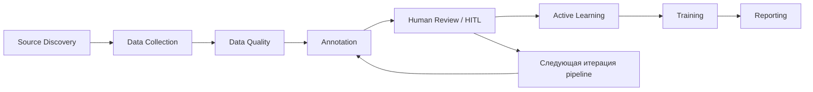

# Universal Agentic Data Pipeline

## Обзор

`Universal Agentic Data Pipeline` — это **offline-first agentic pipeline** для сбора, очистки, авторазметки, human review, active learning и обучения базовой ML-модели на текстовых данных.

Проект сделан как **воспроизводимый research/demo baseline**:

- его можно запускать локально одной командой;
- offline-сценарий остаётся основным и стабильным;
- online-путь существует как расширение, а не как замена baseline;
- human-in-the-loop встроен в архитектуру, а не добавлен формально;
- ML-контур под капотом зафиксирован и объясним.

Проект сейчас ориентирован на **text-first сценарий** и на демонстрацию полного цикла работы с данными.

---

## Supported Scope

Текущий проект сознательно зафиксирован как **text-first pipeline**.

Что поддерживается сейчас:

- текстовые датасеты и текстовые записи, которые можно привести к схеме `text -> effect_label`;
- offline demo запуск и reproducible local baseline;
- online discovery extension для Hugging Face и GitHub shortlist;
- human-in-the-loop review для low-confidence строк;
- active learning track A поверх текстового baseline.

Что пока не считается официально закрытым scope:

- мультимодальность (`audio`, `image`);
- production-grade web scraping;
- hidden API discovery/extraction;
- browser automation (`Selenium`, `Playwright`);
- `requests-html`;
- Kaggle ingestion.

Лучше всего проект подходит для задач вида:

- классификация отзывов;
- классификация коротких текстов и описаний;
- тематические текстовые выборки с небольшим набором целевых классов;
- text datasets, где пользователь заранее задаёт `effect_labels`.

Иными словами, честная формулировка проекта сейчас такая:

`Universal Agentic Data Pipeline` — это **универсальный pipeline для text-first ML-задач**, а не универсальная мультимодальная ingestion-платформа для любых данных.

---

## Архитектурная позиция проекта

- **Offline-first**: основной режим проекта — детерминированный локальный baseline.
- **Dual mode**: offline и online — это две стратегии использования одного и того же пайплайна.
- **Agentic pipeline**: система состоит из последовательности агентов и сервисов, которые передают артефакты друг другу.
- **Human-in-the-loop**: после авторазметки есть реальный шаг ручной проверки и обратного merge.
- **ML is explicit**: в проекте есть явная локальная модель, а не только LLM-обвязка.
- **Русский UX**: ключевые отчёты и инструкции для защиты и ручной проверки формируются на русском языке.

---

## Официальная ML-модель

Официальный локальный baseline проекта:

`TF-IDF + Logistic Regression`

Он используется для задачи:

`text -> effect_label`

Почему именно эта модель:

- она быстро обучается локально;
- полностью воспроизводима;
- понятна на защите;
- не требует дорогой инфраструктуры;
- хорошо подходит для baseline-классификации коротких текстов и отзывов;
- удобно сочетается с active learning loop.

LLM-path в проекте **не заменяет** эту модель. LLM используется только в слое авторазметки, а training и active learning опираются на локальный ML-baseline.

---

## Архитектура пайплайна



Текущая агентная цепочка:

`discovery -> collection -> quality -> annotation -> review/HITL -> active learning -> training -> reporting`

Это не набор отдельных скриптов. Каждый шаг либо создаёт новый артефакт, либо подготавливает вход для следующего этапа.

---

## Что делает каждый агент

### 1. `SourceDiscoveryService`

Ищет и ранжирует кандидатов-источников.

Сейчас поддерживаются:

- offline demo candidates;
- Hugging Face datasets discovery MVP;
- GitHub repository discovery MVP;
- file-based source approval gate.

### 2. `DataCollectionAgent`

Собирает данные из выбранных источников и приводит их к канонической схеме.

Текущая логика:

- `hf_dataset` path для Hugging Face loader;
- `api` path для JSON API endpoints через `requests`;
- `scrape` path для local/demo HTML и selector-based web pages через `requests + BeautifulSoup`;
- soft topic-aware filtering вместо fitness-only фильтра;
- merge нескольких frame-like источников.

### 3. `DataQualityAgent`

Ищет проблемы качества и формирует cleaned dataset.

Текущие проверки включают:

- missing values;
- duplicates;
- outliers;
- class imbalance;
- compare before/after.

### 4. `AnnotationAgent`

Делает авторазметку и подготавливает human review.

Что уже есть:

- deterministic annotation contract;
- prompt/trace layer;
- confidence;
- quality summary;
- Label Studio export helper.

### 5. `ReviewQueueService`

Делает human-in-the-loop видимым:

- экспортирует low-confidence queue;
- принимает corrected queue;
- мержит ручные правки обратно в dataset;
- формирует merge-report.

### 6. `ActiveLearningAgent`

Гоняет active learning поверх локального text baseline.

Текущая база:

- entropy;
- random;
- offline simulation loop;
- learning history;
- comparison report `entropy vs random` для финального качества и числа размеченных примеров.

### 7. `TrainingService`

Обучает финальную baseline-модель и сохраняет артефакты обучения.

---

## Как проект закрывает 4 задания

### Задание 1. `DataCollectionAgent`

Первое задание в проекте закрывается через связку `SourceDiscoveryService` + `DataCollectionAgent`.

Что уже реализовано по сути задания:

- поиск источников по теме;
- загрузка `hf_dataset`;
- реальный `fetch_api(...)` для JSON API;
- реальный `scrape(url, selector)` через `requests + BeautifulSoup`;
- merge нескольких источников в каноническую текстовую схему;
- EDA-артефакты после сбора и очистки.

Честное ограничение текущего состояния: `github_repo` сейчас используется как discovery-кандидат и источник контекста, а не как полноценный collection backend.

### Задание 2. `DataQualityAgent`

Второе задание закрывается через `DataQualityAgent` и отчёты качества.

Что уже есть:

- поиск пропусков;
- поиск дубликатов;
- поиск выбросов;
- анализ дисбаланса классов;
- сравнение до/после;
- cleaned dataset и EDA на очищенных данных.

То есть это уже не отдельный ноутбук-детектив, а встроенный этап единого pipeline.

### Задание 3. `AnnotationAgent`

Третье задание закрывается через `AnnotationAgent` и HITL-контур.

Что уже есть:

- auto-label для text-first сценария;
- confidence-aware review queue;
- annotation trace;
- Label Studio export helper;
- `review_queue.csv` и `review_queue_corrected.csv`;
- agreement и `Cohen's kappa` на reviewed subset;
- reviewer-facing `reports/review_workspace.html`.

Это соответствует идее: агент не просто размечает, а умеет вынести спорные примеры на ручную доразметку и потом честно сравнить авто- и human-labels.

### Задание 4. `ActiveLearningAgent`

Четвёртое задание в текущем проекте реализовано по треку A: `Active Learning`.

Что уже есть:

- локальная модель `TF-IDF + Logistic Regression`;
- active learning loop;
- стратегии `entropy` и `random`;
- история итераций;
- отдельный comparison report по стратегиям;
- связь с HITL и reviewed retrain.

Это делает AL-слой не декоративным, а связанным с качеством реального итогового датасета.

### Финальный `Data Project`

Финальный проект уже собран как единый text-first pipeline, где задания 1–4 работают не отдельно, а как этапы одной системы:

`discovery -> collection -> quality -> annotation -> HITL -> active learning -> training -> reporting`

Именно поэтому текущий репозиторий стоит показывать не как набор домашних заданий, а как единый воспроизводимый агентный data pipeline.

---

## Как показывать проект

Самый безопасный и понятный сценарий показа на защите такой:

1. Сначала показать `README.md` и кратко озвучить, что проект text-first, offline-first и запускается одной командой.
2. Затем запустить `configs/demo_fitness.yaml` или `configs/demo_minecraft.yaml`.
3. После выполнения открыть `reports/run_dashboard.html` как единую точку входа.
4. Из dashboard перейти в `reports/eda_report.html`, `reports/review_workspace.html`, `reports/al_comparison_report.md` и `reports/training_comparison_report.md`.
5. Отдельно проговорить, где именно в pipeline есть человек и как считаются agreement / kappa.
6. Завершить показ `final_report.md`, где уже собраны ключевые пути, метрики и summary запуска.

Что важно проговорить вслух:

- offline demo — это основной стабильный baseline;
- online path — расширение, а не обязательное условие запуска;
- ML-слой в проекте явный и локальный;
- HITL здесь реальный, потому что человек редактирует очередь и влияет на retrain;
- pipeline подходит для text-first задач с настраиваемой темой и своими `effect_labels`.

---

## Режимы работы

### Offline demo mode

Основной и рекомендуемый режим для защиты.

Он использует стабильные demo-конфиги:

- `configs/demo_fitness.yaml`
- `configs/demo_minecraft.yaml`

Преимущества:

- не требует сети;
- детерминирован;
- воспроизводим;
- подходит для демонстрации end-to-end сценария.

### Online mode

Расширенный режим для non-demo конфигов.

Сейчас это **узкий online MVP**, а не full production ingestion:

- Hugging Face discovery;
- GitHub discovery;
- Hugging Face collection path;
- JSON API collection path;
- selector-based web scraping path;
- approval-aware shortlist.

Если online lookup не удался, пайплайн должен безопасно вернуться к стабильному пути и не ломать baseline.

Operational notes для online-path:

- GitHub discovery может работать в `unauthenticated` режиме, но он заметно чувствительнее к rate limits;
- при наличии `GITHUB_TOKEN` GitHub Search path становится стабильнее;
- итог запуска теперь фиксируется в `reports/online_governance_report.md` и `data/raw/online_governance_summary.json`;
- fallback-стратегия остаётся offline-first: пустой remote shortlist не должен ломать весь run.

### Явный runtime.mode

Теперь режим можно фиксировать прямо в конфиге через секцию:

```yaml
runtime:
  mode: offline_demo
```

Поддерживаются четыре значения:

- `offline_demo` — использует только встроенные demo-источники и сохраняет стабильный offline baseline;
- `online` — включает только удалённый discovery path и не подмешивает встроенные demo-кандидаты;
- `hybrid` — разрешает и demo baseline, и online discovery в одном запуске;
- `local_only` — запрещает удалённый discovery и оставляет только локальные/demo-артефакты, если они доступны.

Важно: source-флаги в `source.*` описывают, какие внешние типы источников проект готов использовать, а `runtime.mode` определяет, какие из них реально активны в текущем запуске.

---

## Новый Text Topic

Для запуска на новой теме теперь есть безопасный шаблон:

- `configs/text_topic_template.yaml`
- `configs/text_topic_online.yaml`
- `configs/text_topic_hybrid.yaml`

Этот шаблон нужен для сценария:

1. задать свою текстовую тему в `request.topic`;
2. указать небольшой целевой набор `annotation.effect_labels`;
3. выбрать runtime-режим без изменения кода;
4. использовать тот же pipeline contract, что и в demo-конфигах.

Важно:

- шаблон рассчитан на **текстовую классификацию**, а не на audio/image задачи;
- текущий training layer и active learning layer работают с полями `text` и `effect_label`;
- если вы запускаете проект на новой теме, лучше начинать с малого числа классов и понятного `effect_labels` vocabulary.
- `text_topic_online.yaml` включает чистый remote-discovery сценарий для non-demo запуска;
- `text_topic_hybrid.yaml` включает remote-discovery + scraping flags в одном конфиге, но built-in offline demo fixtures по-прежнему принадлежат только `demo_*` конфигам.

---

## Human-in-the-Loop

HITL в проекте — это обязательный этап после annotation.

Что происходит:

1. строки с низкой уверенностью попадают в `review_queue.csv`;
2. человек редактирует corrected queue;
3. corrected labels мержатся обратно по каноническому `id`;
4. downstream шаги используют уже reviewed dataset.

Это нужно для:

- проверки спорных примеров;
- исправления неоднозначной авторазметки;
- повышения качества датасета перед active learning и training.

Ключевые HITL-артефакты:

- `data/interim/review_queue.csv`
- `reports/review_workspace.html`
- `reports/review_queue_report.md`
- `data/interim/review_queue_context.json`
- `reports/review_merge_report.md`
- `data/interim/review_merge_context.json`
- `reports/review_agreement_report.md`
- `data/interim/review_agreement_context.json`

Если `review_queue.csv` не пустой, основной человеко-ориентированный вход в HITL теперь начинается с `reports/review_workspace.html`.
После повторного запуска с `review_queue_corrected.csv` pipeline также считает честную метрику `auto-vs-human agreement` и `Cohen's kappa` на reviewed subset. Это не два независимых human annotators, а quality-control метрика для HITL-правок.
Дополнительно training layer теперь сохраняет сравнение `baseline auto-label training -> reviewed retrain`, чтобы было видно, как меняются метрики после HITL-правок.

---

## Token-Saving и deterministic path

Проект специально устроен так, чтобы **не уводить всё в LLM**.

Детерминированно в Python выполняются:

- discovery ranking;
- collection;
- schema normalization;
- data quality checks;
- EDA summary;
- merge/reporting helpers;
- training;
- active learning.

LLM используется только там, где он действительно нужен:

- в слое авторазметки;
- в reasoning-sensitive annotation path.

Это делает pipeline:

- дешевле;
- воспроизводимее;
- понятнее для отладки;
- безопаснее для offline demo.

---

## Артефакты, которые создаёт pipeline

Успешный demo-run создаёт, например:

- `reports/run_dashboard.html`
- `final_report.md`
- `data/raw/discovered_sources.json`
- `data/raw/approval_candidates.json`
- `data/raw/online_governance_summary.json`
- `data/raw/merged_raw.parquet`
- `reports/source_report.md`
- `reports/online_governance_report.md`
- `reports/quality_report.md`
- `reports/eda_report.md`
- `reports/eda_report.html`
- `data/interim/eda_context.json`
- `reports/annotation_report.md`
- `reports/annotation_trace_report.md`
- `data/interim/annotation_trace.json`
- `data/interim/review_queue.csv`
- `reports/review_workspace.html`
- `reports/review_queue_report.md`
- `reports/review_merge_report.md`
- `data/interim/review_agreement_context.json`
- `reports/review_agreement_report.md`
- `reports/al_report.md`
- `reports/al_comparison_report.md`
- `data/interim/al_comparison.json`
- `reports/training_comparison_report.md`
- `data/interim/training_comparison.json`
- `data/interim/model_metrics.json`
- `data/interim/model_artifact.pkl`
- `data/interim/vectorizer_artifact.pkl`

---

## Быстрый запуск

### Требования

- Python 3.12+
- локальное виртуальное окружение `.venv`

Установка зависимостей:

```bash
pip install -r requirements.txt
```

### Запуск offline demo

```bash
python run_pipeline.py --config configs/demo_fitness.yaml
python run_pipeline.py --config configs/demo_minecraft.yaml
```

Теперь обычный CLI-запуск сам открывает dashboard после успешного run.

Если по какой-то причине автo-открытие нужно отключить:

```bash
python run_pipeline.py --config configs/demo_fitness.yaml --no-open-dashboard
```

Если хочется вручную форсировать открытие dashboard или review workspace:

```bash
python run_pipeline.py --config configs/demo_fitness.yaml --open-dashboard
python run_pipeline.py --config configs/demo_fitness.yaml --open-review-workspace
```

После запуска удобнее всего начинать просмотр с:

- `reports/run_dashboard.html`
- `final_report.md`
- `reports/eda_report.html`
- `reports/review_workspace.html` если нужен ручной HITL-review

`reports/run_dashboard.html` теперь также показывает cleaned word cloud, собранное из post-quality `text`, чтобы перед retrain можно было быстро проверить тематический фокус очищенных данных.
CLI теперь также печатает в терминал абсолютные пути и `file:///`-ссылки к dashboard, final report, EDA HTML и review workspace, чтобы после первого запуска не искать их вручную.
Dashboard теперь дополнительно содержит `HITL control center` и `LLM annotation center`: там видно очередь ручной проверки, allowed labels, статус corrected queue, активный annotation path, provider/fallback state и быстрые переходы к review/annotation артефактам.

### Основная CLI-команда

```bash
python run_pipeline.py --config path/to/config.yaml
```

CLI в этом блоке не меняется: пайплайн по-прежнему запускается одной командой.
Выбор между offline/online/local сценариями теперь задаётся в самом YAML-конфиге через `runtime.mode`.

---

## Запуск в VS Code

В репозитории добавлены project-level настройки для локального запуска через VS Code:

- `.vscode/settings.json`
- `.vscode/tasks.json`
- `pytest.ini`

Готовые задачи:

- `unit tests`
- `integration smoke`
- `run demo_fitness`
- `run demo_fitness and open dashboard`
- `run demo_minecraft`
- `run demo_minecraft and open dashboard`
- `open launcher`
- `open dashboard`
- `open runtime settings`
- `open source approval workspace`
- `open review workspace`

Для первого знакомства с проектом удобно начинать с `open launcher`: это статическая стартовая страница `ui/project_launcher.html`, где собраны demo-конфиги, команды первого запуска, ссылки на dashboard, `runtime_settings.html`, source approval workspace, review workspace и напоминания про `GEMINI_API_KEY` / `GITHUB_TOKEN`.

Что делать:

1. Откройте репозиторий в VS Code.
2. Выберите интерпретатор `.\.venv\Scripts\python.exe`.
3. Откройте `Testing`, чтобы VS Code увидел `pytest`.
4. Для ручного запуска используйте `Terminal -> Run Task`.

`pytest.ini` направляет временные pytest-артефакты в локальную рабочую директорию проекта, чтобы test workflow не зависел от системного temp-каталога.

---

## Gemini-path

Gemini-интеграция в проекте — это **опциональное расширение annotation layer**.

Она включается только если одновременно выполнены условия:

- `annotation.use_llm: true`
- `annotation.llm_provider: gemini`
- в окружении задан `GEMINI_API_KEY`

Если ключ отсутствует, пайплайн не падает и делает fallback на `MockLLM`.

PowerShell-пример:

```powershell
$env:GEMINI_API_KEY = 'your-gemini-api-key'
python run_pipeline.py --config configs/your_gemini_config.yaml
```

Проверить, какой путь реально отработал, можно в:

- `data/interim/annotation_trace.json`
- `reports/annotation_trace_report.md`

Ожидаемая семантика:

- `generate_parse` — Gemini path
- `classify_effect` или fallback path — локальный/mock path

---

## Approval gate

После discovery shortlist можно вручную ограничить через:

`data/raw/approved_sources.json`

Это простой JSON-список `source_id`, который определяет, какие источники пойдут дальше в collect stage.

Таким образом в проекте уже есть видимый approval checkpoint между discovery и collection.

Для ручного approval теперь дополнительно используются:

- `data/raw/approval_candidates.json` — shortlist в JSON с `license`, `license_status`, `robots_txt_status`, `robots_txt_url`, `approval_notes`;
- `reports/source_report.md` — человекочитаемый markdown shortlist с теми же governance-полями для просмотра перед approve.

Это позволяет не смешивать discovery с автоматическим "юридическим движком", но делает license/robots проверку видимой частью HITL approval flow.

---

## Сильные стороны текущего baseline

- стабильный offline demo;
- один pipeline entrypoint;
- явная ML-модель;
- видимый HITL;
- русскоязычные отчёты;
- active learning layer;
- traceable annotation contract;
- dual-mode архитектура без разрушения baseline.

---

## Текущие ограничения

Проект пока не претендует на full production-ready систему.

Текущие осознанные ограничения:

- text-first фокус;
- online ingestion слой пока MVP;
- governance/compliance уже покрывает базовые `license` и `robots.txt` сигналы в approval artifacts, но ещё не является полным policy engine;
- rate-limit awareness и fallback reporting уже вынесены в отдельный online governance layer, но это ещё не полный observability/monitoring stack;
- scraping не является production-ready браузерным пайплайном;
- мультимодальность пока не главный трек.

Именно поэтому архитектурная ставка в проекте сейчас такая:

**надёжный offline-first baseline + понятный agentic pipeline + видимый HITL + явная ML-модель + аккуратный online extension.**

